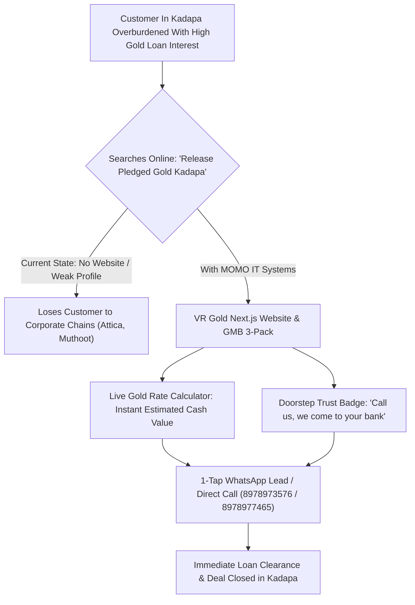

# COMMERCIAL PROPOSAL & DIGITAL TRANSFORMATION QUOTATION

**Proposal Reference:** `MIT/PROP/2026/VRG-01`  
**Date of Issuance:** October 1, 2026  
**Valid Until:** October 15, 2026  
**Service Provider:** **MOMO IT TECHNOLOGIES**, Kadapa  
**Client:** **VR GOLD BUYER'S (Gold Release & Renewal)**, Kadapa  

---

```
╔════════════════════════════════════════════════════════════════════════════════════════════════╗
║                                 MOMO IT TECHNOLOGIES                                           ║
║                    Enterprise Software Development & Premier Digital Agency                    ║
║               4/106, Chowdeswari Temple Lane, Krishnapuram, Kadapa, AP — 516003                ║
║                 Phone / WhatsApp: +91 86398 31132 | Email: momoit.technologies@gmail.com       ║
║                                Website: www.momoittechnologies.com                             ║
╚════════════════════════════════════════════════════════════════════════════════════════════════╝
```

---

## 1. Verified Client Profile & Core Identity


### Verified Business Information:
- **Business Entity:** **VR GOLD BUYER'S**
- **Brand Motto:** *"WE ARE FOR YOU"*
- **Official Subtitle:** **GOLD RELEASE & RENEWAL**
- **Primary Contact Numbers:** 
  - 📞 **+91 89789 73576**
  - 📞 **+91 89789 77465**
- **Official Branch & Operating Address:**  
  **D.No. 42/1201, Beside Mruthunjayakunta Sivalayam, Near Y-Junction, NGO Colony, KADAPA, Andhra Pradesh.**
- **Core Market Service Verticals:**
  1. **తాకట్టు పెట్టిన బంగారాన్ని విడిపించి ఈ రోజు మార్కెట్ రేటుకు కొనబడును:** Pledged gold from nationalized banks, cooperative societies, and private NBFCs (Muthoot, Manappuram, Chola, etc.) is cleared and purchased at live daily market spot rates.
  2. **మీరు తాకట్టు పెట్టిన బంగారానికి అధిక వడ్డీ చెల్లిస్తున్నారా!:** Helping Kadapa families and business owners escape compounding monthly bank/finance interest traps by releasing their gold and liquidating equity.
  3. **కాల్ చేసిన వెంటనే మీ దగ్గరకే వచ్చి డబ్బులు కట్టి విడిపించబడును (KEY USP):** **Doorstep / Direct At-Location Service** — on receiving a call, the VR Gold team meets the customer directly, visits the bank/finance company, clears the pending loan dues with full cash backing, and pays the remaining surplus value directly to the customer on the spot.

---

## 2. Why VR Gold Needs a High-Speed Website & Digital Presence



### The Huge Growth Opportunity for VR Gold in Kadapa:
1. **High Transaction Ticket Size:** A single customer in Kadapa releasing 40 to 100 grams of gold represents a transaction of ₹2,50,000 to ₹7,50,000+. Gaining even **3 to 5 additional clients per week** through online search will generate massive monthly gross profits that easily pay for the entire digital marketing spend many times over.
2. **Eliminating Trust Hesitation:** Customers with pledged gold are nervous about scams. Having an official, elegant website displaying **D.No. 42/1201 Near Y-Junction NGO Colony, Kadapa**, live transparent gold rates, 100% Karatmeter testing purity standards, and customer video testimonials provides instant institutional trust.
3. **Promoting the Killer USP — Doorstep Bank Visit:** Most competitors make customers travel to their shop first. VR Gold’s promise — *"కాల్ చేసిన వెంటనే మీ దగ్గరకే వచ్చి డబ్బులు కట్టి విడిపించబడును"* — is a game-changing marketing hook when placed prominently on Google Ads, Instagram Reels, and the website hero banner.

---

## 3. Comprehensive Scope of Work

### Phase 1: High-Conversion Next.js Web Engineering (One-Time Setup)

| Feature / Module | Purpose & Technical Specifications |
|---|---|
| **Speed & Mobile-First UX** | Sub-second loading (<0.8s) built on Next.js 15 + Tailwind CSS. Designed specifically for Kadapa smartphone users with instant interactive responsiveness. |
| **Interactive Live Gold Rate & Value Calculator** | A real-time calculator widget where customers select purity (22K 916 / 24K 999), type the gross weight in grams, and see an estimated spot cash payout instantly. |
| **Doorstep Service Highlight Banner** | Prominently feature: *"D.No. 42/1201, Beside Mruthunjayakunta Sivalayam, Near Y-Junction, NGO Colony, KADAPA"* with an interactive Google Map route button and *"Call for Doorstep Bank Clearance: 8978973576"*. |
| **Step-by-Step Pledged Gold Release Explainer** | Clear visual guide (bilingual Telugu/English) breaking down: *1. Free Valuation → 2. VR Gold visits bank with you → 3. Loan paid in full → 4. Balance cash handed over*. |
| **Instant Action Triggers** | Floating sticky bottom bar on mobile with: **[📞 Call 8978973576]** | **[📞 Call 8978977465]** | **[💬 WhatsApp Quote]**. |
| **Local Kadapa SEO & Schema Graph** | Advanced Schema.org JSON-LD (`FinancialService`, `GoldDealer`, `LocalBusiness`), geo-coordinates (NGO Colony Kadapa), dynamic sitemaps, and SSL HTTPS security. |
| **Annual Hosting & Domain** | 12 Months cloud server deployment with 99.9% uptime and `.com` or `.in` domain registration (`vrgoldkadapa.com` / `vrgoldbuyers.com`). |

---

### Phase 2: Monthly Digital Lead Engine & Local Dominance Retainer

#### 1. Google Business Profile (GMB) / Maps 3-Pack Optimization
- Optimize listing for: **VR GOLD BUYER'S — Gold Release & Pledged Gold Loan Clearance Kadapa**.
- Add secondary categories: *Gold Dealer, Financial Consultant, Pawn Shop, Jewellery Buyer*.
- Target top 3 Google Maps pack rankings across Kadapa for:
  - *“Gold buyers near me Kadapa”*
  - *“Release pledged gold in Kadapa”*
  - *“Sell gold jewellery for instant cash Kadapa”*
  - *“Bank gold loan clearance Kadapa”*
  - *“Gold buyers NGO colony Kadapa”*
- Weekly geotagged photo updates and review management campaign.

#### 2. High-Intent Google Search Ads (PPC) Management
- Setup and daily optimization of Google Search Ads targeting urgent cash-seekers in Kadapa within a 25 km radius.
- Call-only ads displayed prominently between 9:00 AM – 8:00 PM linking directly to `8978973576`.
- Negative keyword filtering (protecting budget from irrelevant queries).

#### 3. Social Media Management & Creative Production (Instagram & Facebook)
- **12 Custom Branded Graphics / Month:** Daily gold rate templates, festival offers, interest-saving calculations, and location awareness creatives centered around Y-Junction NGO Colony.
- **4 Viral Video Reels / Month:** High-retention short videos featuring Telugu voiceovers/hooks:
  - Reel 1: *“Are you paying heavy monthly interest on bank gold loans? Here is how to stop it today!”*
  - Reel 2: *“How VR Gold releases your pledged jewellery directly at the bank.”*
  - Reel 3: *“Live 22K/24K Gold Rate transparency in Kadapa.”*
  - Reel 4: *“Visit VR Gold beside Mruthunjayakunta Sivalayam, NGO Colony, Kadapa.”*

#### 4. WhatsApp Automated Lead Routing
- Automated instant reply with today's 22K/24K gold rates, Kadapa office address, and Google Maps direction link.
- Immediate notification dispatched to owner’s phone when a customer requests a doorstep gold evaluation.

---

## 4. Investment Options & Packages

```
┌────────────────────────────────────────────────────────────────────────────────────────┐
│                        COMMERCIAL PACKAGES FOR VR GOLD KADAPA                          │
├─────────────────────────┬────────────────────────────┬─────────────────────────────────┤
│ Option 1: STARTER       │ Option 2: GROWTH ENGINE ★  │ Option 3: MARKET DOMINANCE      │
│ (Local Map + Social)    │ (RECOMMENDED BEST VALUE)   │ (Aggressive Kadapa Leader)      │
├─────────────────────────┼────────────────────────────┼─────────────────────────────────┤
│ • Custom Next.js Web    │ • Custom Next.js Web       │ • Advanced Portal + Multi-Pages │
│ • GMB Profile Setup     │ • Live Gold Rate Calc      │ • Multi-Area Map Domination     │
│ • 8 Social Creatives/Mo │ • GMB 3-Pack Rank Engine   │ • Google PPC + Meta Lead Ads    │
│ • Basic Click-to-Call   │ • Google Ads PPC Mgmt      │ • 20 Creatives + 8 Reels/Month  │
│ • WhatsApp Link         │ • 12 Posts + 4 Reels/Month │ • Automated AI WhatsApp Bot     │
│                         │ • WhatsApp Lead Automation │ • Dedicated Campaign Manager    │
├─────────────────────────┼────────────────────────────┼─────────────────────────────────┤
│ Setup (One-Time):₹14,999│ Setup (One-Time): ₹19,999  │ Setup (One-Time): ₹29,999       │
│ Retainer: ₹9,999/month  │ Retainer: ₹16,999/month    │ Retainer: ₹28,999/month         │
└─────────────────────────┴────────────────────────────┴─────────────────────────────────┘
```

> [!TIP]
> **Why Option 2 (Growth Engine) is the Best Choice for VR Gold:**  
> High-intent customers searching Google on mobile are ready to transact the very same day. Option 2 captures these customers with Google Search Ads and the GMB Map 3-Pack, while building social credibility through weekly Reels and WhatsApp automation.

---

## 5. Itemized Cost Breakdown (Option 2 — Recommended)

### Part A: One-Time Website Engineering & Digital Foundation

| S.No | Deliverable Description | HSN/SAC | Qty | Unit Rate (₹) | Total (₹) |
|---|---|---|---|---|---|
| 01 | **Custom Next.js 15 Website:** Mobile-first, responsive, 5 conversion sections, Live Gold Rate Calculator, Doorstep Service explainer, Trust badges. | 998313 | 1 Job | ₹14,000.00 | ₹14,000.00 |
| 02 | **Local Kadapa SEO & Digital Asset Integration:** Schema.org JSON-LD, Google Search Console, Google Analytics 4, Meta Pixel. | 998313 | 1 Job | ₹3,500.00 | ₹3,500.00 |
| 03 | **Annual Domain (.com/.in), SSL & High-Speed Cloud Hosting:** 12 Months dedicated cloud deployment with 99.9% uptime guarantee. | 998315 | 1 Year | ₹2,499.00 | ₹2,499.00 |
| **A** | **SUBTOTAL (ONE-TIME SETUP)** | | | | **₹19,999.00** |

---

### Part B: Monthly Digital Marketing Retainer

| S.No | Ongoing Monthly Deliverables | HSN/SAC | Frequency | Monthly Fee (₹) |
|---|---|---|---|---|
| 01 | **Google My Business (GMB) 3-Pack Optimization:** Weekly keyword posts, geotagged photos, review acceleration strategy for NGO Colony / Kadapa area. | 998314 | Monthly | ₹4,500.00 |
| 02 | **Google Search Ads (PPC) Campaign Management:** Call-only ads targeting high-intent gold release keywords across Kadapa radius. *(Client pays ad budget directly to Google)* | 998314 | Monthly | ₹5,000.00 |
| 03 | **Social Media Production (Instagram & Facebook):** 12 custom branded Telugu/English posters + 4 high-retention video Reels (scripts, shooting guidelines, editing). | 998314 | Monthly | ₹5,000.00 |
| 04 | **WhatsApp Lead Capture & Monthly Growth Reporting:** Instant notification dispatch on high-intent inquiries + monthly review report on calls and leads. | 998314 | Monthly | ₹2,499.00 |
| **B** | **SUBTOTAL (MONTHLY RETAINER)** | | | **₹16,999.00 / Month** |

---

## 6. Official Proforma Tax Invoice (Month 1 Billing)

```
┌────────────────────────────────────────────────────────────────────────────────────────┐
│                                   PROFORMA TAX INVOICE                                 │
├────────────────────────────────────────────────────────────────────────────────────────┤
│ INVOICE NUMBER: MIT/2026-27/VRG-001             INVOICE DATE: October 01, 2026         │
│ PAYMENT DUE: Upon Project Kickoff               BILLING PERIOD: Month 1 (Setup + Ads)  │
├────────────────────────────────────────────────────────────────────────────────────────┤
│ SERVICE PROVIDER:                               BILLED TO (CLIENT):                    │
│ MOMO IT TECHNOLOGIES                            VR GOLD BUYER'S                        │
│ 4/106, Chowdeswari Temple Lane,                 D.No. 42/1201,                         │
│ Krishnapuram, Kadapa, AP — 516003               Beside Mruthunjayakunta Sivalayam,     │
│ Contact: +91 86398 31132 / +91 76762 79500     Near Y-Junction, NGO Colony, KADAPA.   │
│ Email: momoit.technologies@gmail.com            Phone: +91 89789 73576 / 89789 77465   │
│ Website: www.momoittechnologies.com             Kind Attn: Proprietor / Management     │
├────────────────────────────────────────────────────────────────────────────────────────┤
│ ITEM DESCRIPTION                                             SAC CODE      AMOUNT (₹)  │
├────────────────────────────────────────────────────────────────────────────────────────┤
│ 1. Complete Website Engineering (Next.js 15, Live Gold Rate     998313      ₹14,000.00 │
│    Calculator, Mobile CRO, Doorstep Bank Clearance Showcase)                           │
│ 2. Domain Registration (.in/.com), SSL & 1-Year Fast Hosting    998315       ₹2,499.00 │
│ 3. Digital Asset Setup (GSC, GA4, GMB Schema, Meta Pixel)       998313       ₹3,500.00 │
│ 4. Month 1 Digital Marketing Retainer (GMB 3-Pack Dominance,    998314      ₹16,999.00 │
│    Google Ads Management, 12 Social Creatives + 4 Reels,                               │
│    WhatsApp Lead Funnel & Weekly Performance Tracking)                                 │
├────────────────────────────────────────────────────────────────────────────────────────┤
│ GROSS TOTAL BEFORE DISCOUNTS:                                               ₹36,998.00 │
│ SPECIAL KADAPA LOCAL BUSINESS INAUGURAL DISCOUNT:                          - ₹4,999.00 │
├────────────────────────────────────────────────────────────────────────────────────────┤
│ NET PAYABLE AMOUNT FOR MONTH 1 (Setup + Month 1 Marketing):                 ₹31,999.00 │
│ RECURRING MONTHLY AMOUNT (Month 2 Onwards):                                 ₹16,999.00 │
├────────────────────────────────────────────────────────────────────────────────────────┤
│ AMOUNT IN WORDS: Thirty-One Thousand Nine Hundred and Ninety-Nine Rupees Only          │
└────────────────────────────────────────────────────────────────────────────────────────┘
```

---

## 7. Official Vendor Banking & UPI Payment Coordinates

```
┌────────────────────────────────────────────────────────────────────────────────────────┐
│                         OFFICIAL VENDOR BANKING COORDINATES                            │
├─────────────────────────┬──────────────────────────────────────────────────────────────┤
│ Beneficiary / Payee     │ Mr. Damerla Mohan / MOMO IT Technologies                     │
│ Bank Name               │ State Bank of India (SBI)                                    │
│ Bank Account Number     │ 37821607076                                                  │
│ IFSC Code               │ SBIN0013231                                                  │
│ Account Type            │ Current / Primary Settlement Account                         │
│ Official UPI ID (VPA)   │ momopedeals@oksbi                                            │
│ Billing WhatsApp Desk   │ +91 86398 31132 / +91 76762 79500                            │
│ Online Pay Portal       │ https://www.momoittechnologies.com/pay                       │
└─────────────────────────┴──────────────────────────────────────────────────────────────┘
```

### Payment Schedule for Month 1:
- **Milestone 1 (Kickoff Advance - 50% of Setup):** **₹16,000** to register domain, start website development, and initiate Google My Business audit.
- **Milestone 2 (Go-Live):** **₹15,999** upon live website launch, Google Maps verification, and campaign activation.
- **Month 2 Onwards:** Invoiced at **₹16,999 / month** on the 1st of each calendar month.

---

## 8. Rollout Timeline (14 Days to Full Launch)

```
Days 1–3: Architecture & Domain
├── Register domain (e.g. vrgoldkadapa.com) & configure cloud hosting
├── Setup local Kadapa GMB profile optimizations for NGO Colony
└── Draft Telugu/English website copy highlighting Doorstep Bank Clearance

Days 4–7: Development & Live Calculator
├── Build Next.js 15 responsive website
├── Program the interactive Live Gold Rate Estimator widget
└── Implement mobile click-to-call buttons for 8978973576 & 8978977465

Days 8–10: Staging Review & Launch
├── Client review of website on test link & approval
├── Live production deployment with SSL certificate
└── Deliver 1st batch of social creatives + initial Reel

Days 11–14: Ad Campaigns & WhatsApp Funnel
├── Activate Google Search Ads for high-intent Kadapa searches
├── Configure WhatsApp auto-response with location & live gold rate
└── Delivery of tabletop QR cards for Google 5-star review collection
```

---

## 9. Client Acceptance & Signature

To accept this quotation and commence project onboarding, please sign below or confirm via WhatsApp to `+91 86398 31132`.

**For VR GOLD BUYER'S (Kadapa):**  
Proprietor / Authorized Signatory: ________________________________  
Date: ___________________________________  
Contact: +91 89789 73576 / +91 89789 77465  
Address: D.No. 42/1201, Beside Mruthunjayakunta Sivalayam, NGO Colony, Kadapa.  

**For MOMO IT TECHNOLOGIES:**  
**Mohan Damerla**  
Founder & CEO, MOMO IT Technologies  
Phone: +91 86398 31132  
Address: 4/106, Chowdeswari Temple Lane, Krishnapuram, Kadapa — 516003  
Website: [www.momoittechnologies.com](https://www.momoittechnologies.com)  
